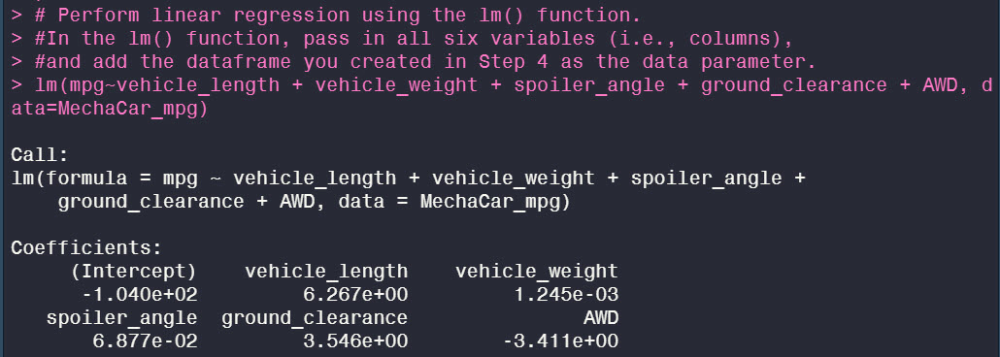
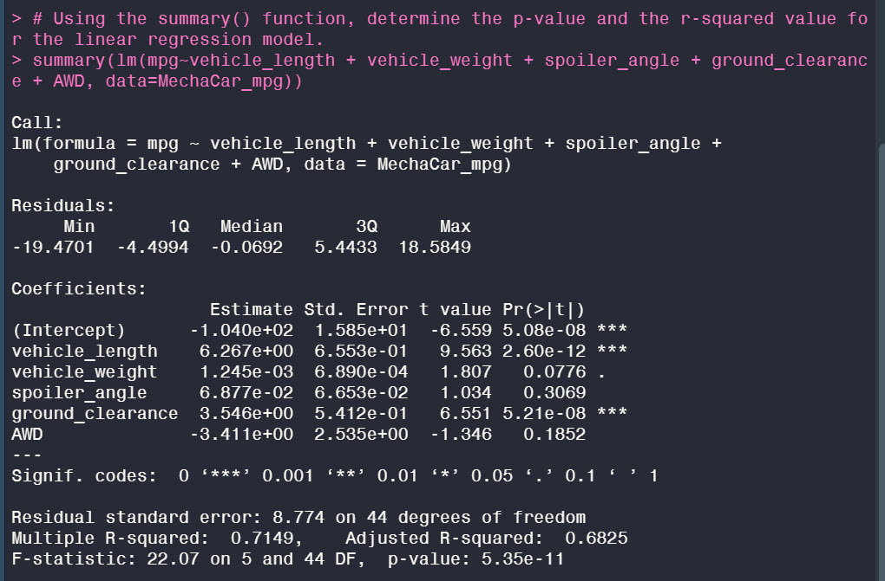
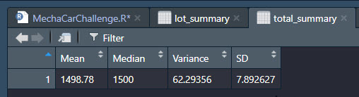
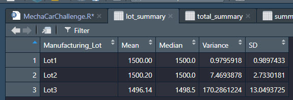
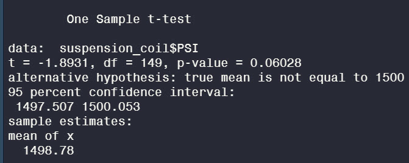
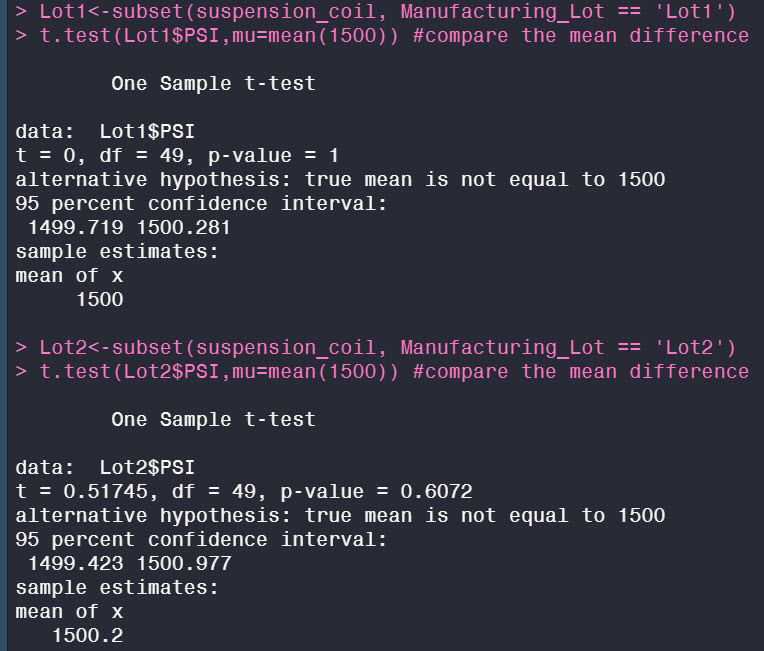
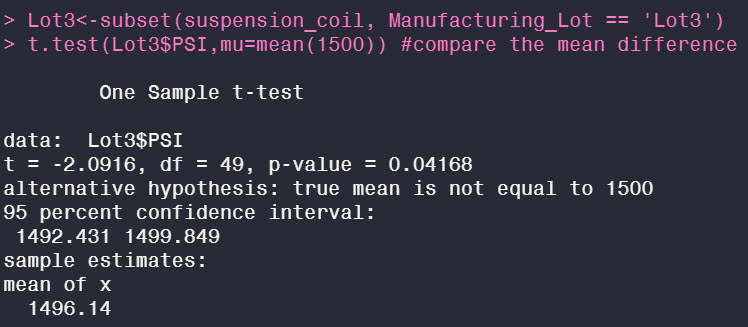

# MechaCar_Statistical_Analysis

## Linear Regression to Predict MPG

An analysis of the relationship between the miles per gallon vs vehicle length, vehicle weight, spoiler angle, ground clearance, and AWD was completed. 

The lm() function was used to perform a linear regression against all six variables. 

The summary function was used to determine the p-value and r-squared value for the linear regression model.

**p-value**:5.35

**r-squared**:0.7149

### Which variables/coefficients provided a non-random amount of variance to the mpg values in the dataset?
Based on the results of the liner regression the vehicle length and ground clearance variables provided a non-random amount of variance.

### Is the slope of the linear model considered to be zero? Why or why not?
The slope is not considered to be zero. The p-value is 5.35, which is lower than the significance level 0.05.

### Does this linear model predict mpg of MechaCar prototypes effectively? Why or why not? 
Based on the R-squared value of 0.71 we can confidently state that the model effectively predicts the mpg of MechaCar prototypes. 

## Summary Statistics on Suspension Coils

Does the current manufacturing data meet the design specificiation for the MechaCar suspension coils which dictate that the variance of the suspension coils must not exceed 100 PSI in the total?

The total summary table of the Suspension Coils is displayed below. Based are the results of Variance of 62.29356 in total summary table, we can conclude that the current manufacturuing data meets the design specifications for suspension coils. 

Does the current manufacturing data meet the design specificiation for the MechaCar suspension coils which dictate that the variance of the suspension coils must not exceed 100 PSI in the lot summary?

The lot summary table of the Suspension Coils is displayed below. Based are the results of the Variance in the lot summary table, we can conclude that the current manufacturuing data does not meet the design specifications for suspension coils in Lot3 (Variance 170.2861), however the data does meet the design specifications for suspension coils in Lot1 (Variance 0.9759)  and Lot2 (Variance 7.4694). 

## T-Tests on Suspension Coils

In this section we will perform t-tests to determine if all manufacturing lots and each lot individually are statistically different from the population mean of 1,500 pounds per square inch.

Using  a significance level of 95% we performed t-test to determine if any of the lots had a statistical difference from the mean of 1500. Looking at the outcome of the t-test for the combined t-test for all three Lots (p-value:0.06028), we were able to see that all three lots have a p-value larger that 0.05, which is larger than the significance level of 95%. As a result, we can conclude that there is not enough evidence to reject the null hypothesis. 

The combined PSIs are not statiscally different from the population mean of 1500 psi. 

**-T-test for Each individual Lot against mean population PSI of 1500**

**Lot 1 t-test**:  p-value is 1. This is greater than 0.05, which means we can reject the null hypothesis. The psi of Lot 1 is not statistically different from the mean population. 

**Lot 2 t-test**:  p-value is 0.6072. This is greater than 0.05, which means we can reject the null hypothesis. The psi of Lot 2 is not statistically different from the mean population. 

**Lot 3 t-test**:  p-value is 0.04168 This is less than 0.05, which means we can accept the null hypothesis. The psi of Lot 3 is statistically different from the mean population. 

## Study Design: MechaCar vs Competition

In this section we will provide a statistical study that can quantify how the MechaCar performs against the competition.

What metric or metrics are you going to test?
We will use the price of the vehicle, fuel efficiency, maintenance cost, and safety ratings in our metrics. 

What is the null hypothesis or alternative hypothesis?

The Null Hypothesis (Ho) = MechaCar vehicles are a better overall value than other car manufacturers when looking at price, fuel efficiency,  and safety. 
The Alternate Hypothesis (Ha) = MechaCar vechicles are not a better overall value than other car manufacturers

What statistical test would you use to test the hypothesis? And why? 

ANOVA test to determine if there is a statistically significant mean difference between multiple car manufacturers. 
Multiple Linear Regression to  determine how much variance in the dependent variable is accounted for in a linear
combination of independent variables. This will be useful in determining if there is any relationship between the price of a vehicle and safety or fuel ratings. 

What data is needed to run the statistical test?
We would require the same type of data, such as fuel efficiency, price, and safety, from other car manufacturers to run the statistical tests. 
